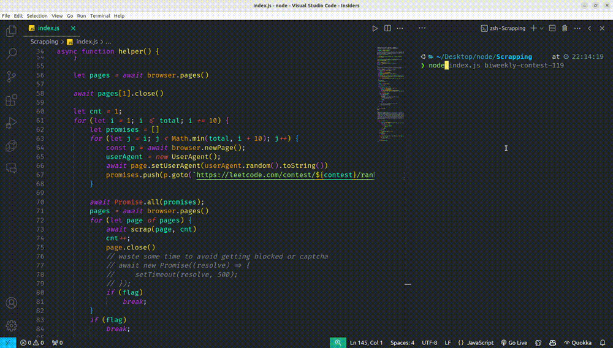
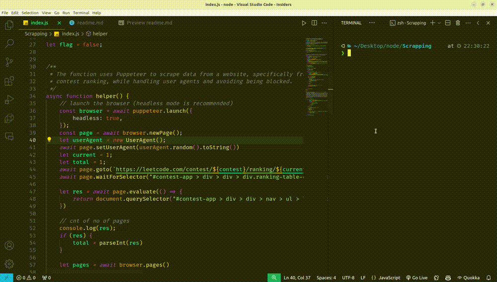
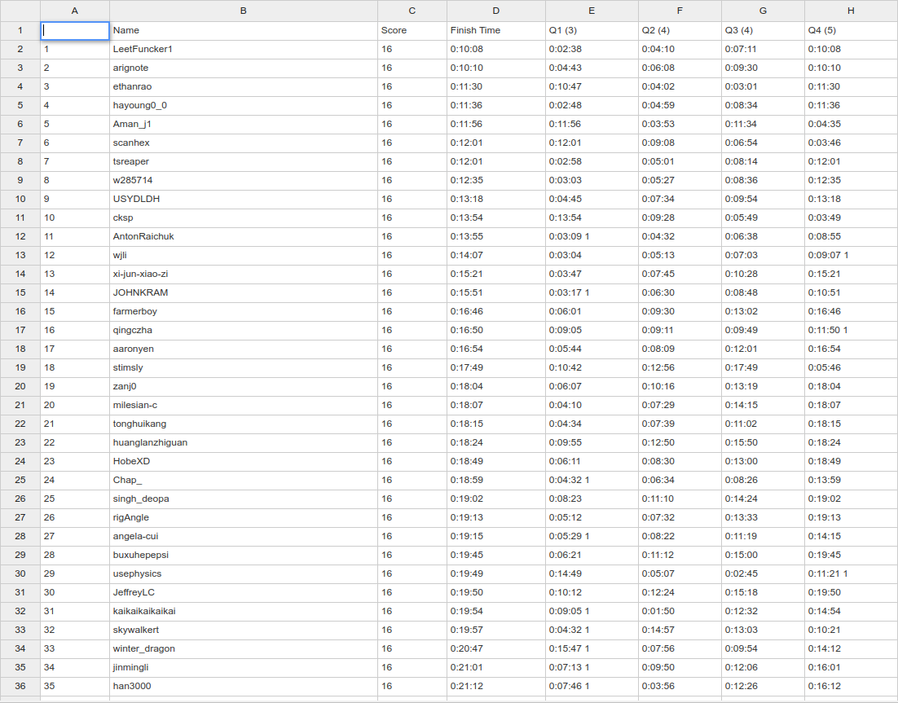

# LeetCode Contest Ranking Scraper

This project scrapes contest ranking data from LeetCode and saves it to a CSV file.

## Features

* Scrapes contest ranking data from multiple pages
* Writes the scraped data to a CSV file
* Uses Puppeteer for browser automation
* Employs stealth techniques to avoid detection
* Handles errors gracefully

## Dependencies

* Node.js
* puppeteer-extra
* user-agents
* puppeteer-extra-plugin-stealth
* fs


## Getting Started

These instructions will get you a copy of the project up and running on your local machine for development and testing purposes.

### Prerequisites

You need to have Node.js and npm installed on your machine. You can download Node.js [here](https://nodejs.org/en/download/) and npm is included in the installation.


### Installation

1. clone the repository to your local machine:

```bash
git clone https://github.com/Abhi-cpp/LeetCode-Rank-Scraper.git
```

2. Navigate to the project directory.

```bash
cd LeetCode-Rank-Scraper
```
3. Install dependencies by running:
```bash
npm install
```

## Command to Run
```js
node index.js name-of-the-contest

# example
node index.js weekly-contest-388
```

## Screenshots
1. Running app in head mode.

```js
const browser = await puppeteer.launch({
        headless: false,
    });
```



2. Running app in headless mode.

```js
const browser = await puppeteer.launch({
        headless: true,
    });
```



3. CSV file preview



